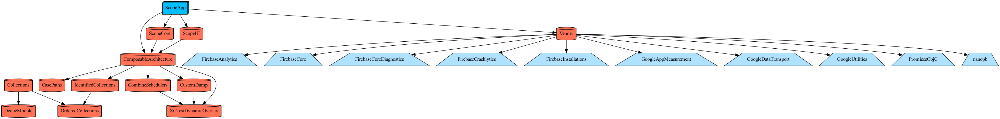

[](https://tuist.io)
[](https://github.com/pointfreeco/swift-composable-architecture)


## Scope

### Project bootstrap

#### 1.Install tuist
```
$ curl -Ls https://install.tuist.io | bash
```
#### 2.Run tuist generate and open project
```
$ tuist generate --open
```

### Project dependencies


### TDD
TDD는 기본적으로 Red Green Refactor사이클을 따르며 프로덕션 코드를 작성하기 전에 테스트를 먼저 작성합니다

#### Refactor
*코드 리팩터링의 궁극적인 목표는 코드를 보다 이해하기 쉽도록 하고 예상 가능한 변동에 대비할 수 있도록 코드를 변경하는것에 목적이 있습니다.*
- 한 메서드에 오직 한 단계의 Indent만 허용합니다.
- else 예약어를 사용하지 않습니다.
- 메소드가 한 가지 일만 하도록 구현합니다.
- 로컬 변수가 정말로 필요한지 고민합니다.
- `compos method 패턴`을 적용합니다. 

> `compos method 패턴` 메소드의 의도가 잘 드러나도록 동등한 수준의 작업을 하는 여러 단계로 나누는 패턴
